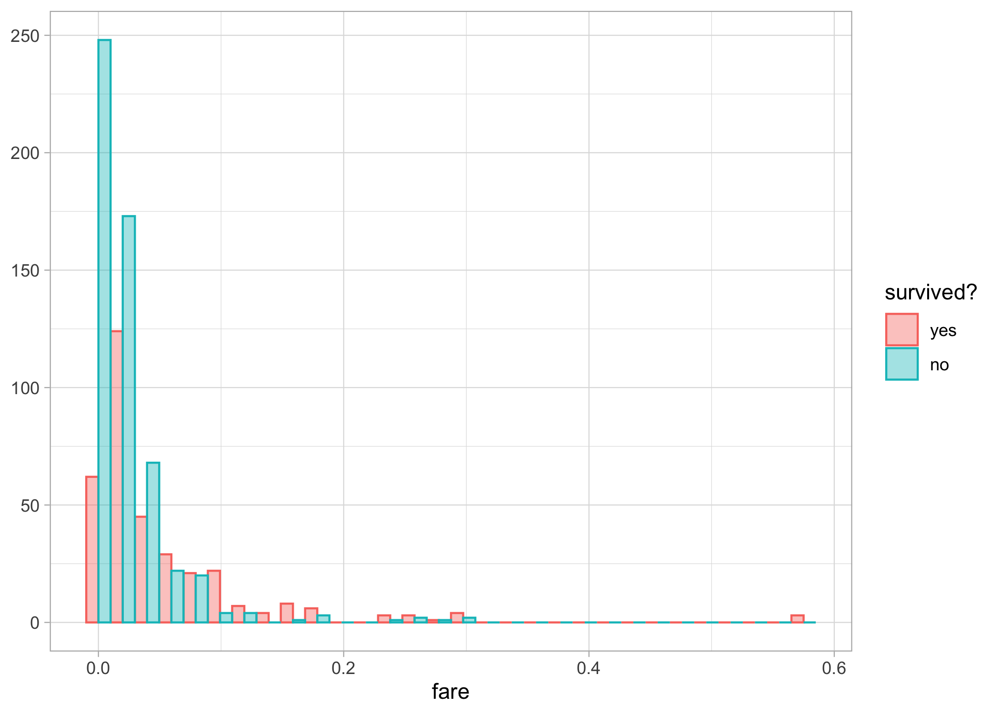
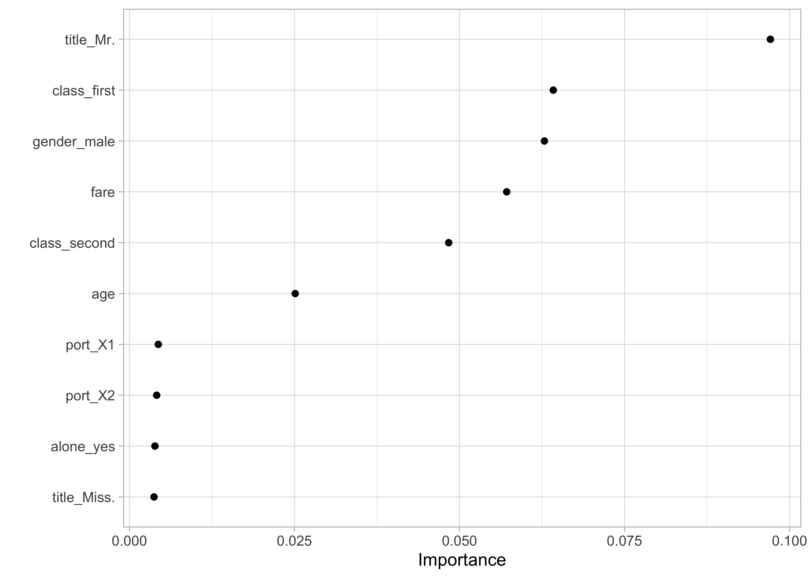
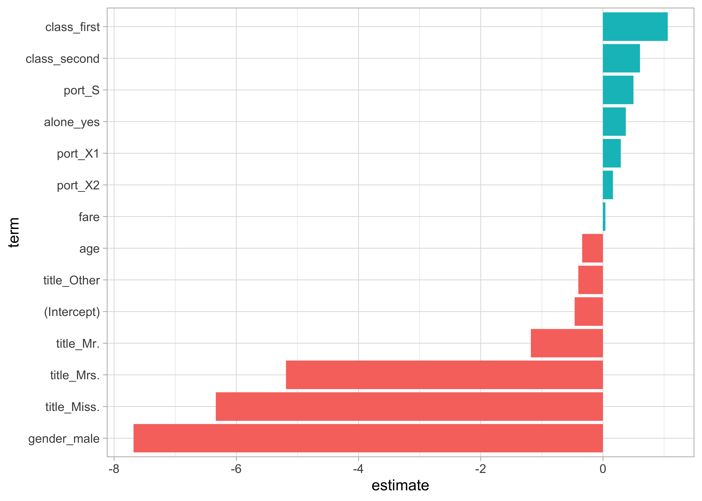

## Motivation

I would like to familiarize myself with machine learning (ML) techniques in `R`. So I have been reading and learning by doing. I thought I'd share my experience for others who'd like to give it a try.

The two great books I'm using are: 

+ [An Introduction to Statistical Learning with Applications in R](https://www.statlearning.com/) by Gareth James, Daniela Witten, Trevor Hastie and Robert Tibshirani  

+ [Tidy models in R](https://www.tmwr.org/) by Max Kuhn and Julia Silge     

I also recommend checking out the material (codes, screencasts) shared by [David Robinson](http://varianceexplained.org/r/sliced-ml/) and [Julia Silge](https://juliasilge.com/). 

To try things, I've joined the [Kaggle](https://en.wikipedia.org/wiki/Kaggle) online community which gathers folks with lots of experience in ML from whom you can learn. Kaggle also hosts public datasets that can be used for playing around. 

Let's start with the famous [Titanic dataset](https://www.kaggle.com/c/titanic/overview). We need to predict if a passenger survived the sinking of the Titanic (1) or not (0). A dataset is provided for training our models (train.csv). Another dataset is provided (test.csv) for which we do not know the answer. We will predict survival for each passenger, submit our answer to Kaggle and see how well we did compared to other folks. The metric for comparison is the percentage of passengers we correctly predict -- aka as accuracy. 

First things first, let's load some packages to get us started. 

```r
library(tidymodels) # metapackage for ML 
library(tidyverse) # metapackage for data manipulation and visulaisation
library(stacks) # stack ML models for better perfomance
theme_set(theme_light())
doParallel::registerDoParallel(cores = 4) # parallel computations
```

## Data

Read in training data.

```r
rawdata <- read_csv("dat/titanic/train.csv")
glimpse(rawdata)
```

```
## Rows: 891
## Columns: 12
## $ PassengerId <dbl> 1, 2, 3, 4, 5, 6, 7, 8, 9, 10, 11, 12, 13, 14, 15, 16, 17,…
## $ Survived    <dbl> 0, 1, 1, 1, 0, 0, 0, 0, 1, 1, 1, 1, 0, 0, 0, 1, 0, 1, 0, 1…
## $ Pclass      <dbl> 3, 1, 3, 1, 3, 3, 1, 3, 3, 2, 3, 1, 3, 3, 3, 2, 3, 2, 3, 3…
## $ Name        <chr> "Braund, Mr. Owen Harris", "Cumings, Mrs. John Bradley (Fl…
## $ Sex         <chr> "male", "female", "female", "female", "male", "male", "mal…
## $ Age         <dbl> 22, 38, 26, 35, 35, NA, 54, 2, 27, 14, 4, 58, 20, 39, 14, …
## $ SibSp       <dbl> 1, 1, 0, 1, 0, 0, 0, 3, 0, 1, 1, 0, 0, 1, 0, 0, 4, 0, 1, 0…
## $ Parch       <dbl> 0, 0, 0, 0, 0, 0, 0, 1, 2, 0, 1, 0, 0, 5, 0, 0, 1, 0, 0, 0…
## $ Ticket      <chr> "A/5 21171", "PC 17599", "STON/O2. 3101282", "113803", "37…
## $ Fare        <dbl> 7.2500, 71.2833, 7.9250, 53.1000, 8.0500, 8.4583, 51.8625,…
## $ Cabin       <chr> NA, "C85", NA, "C123", NA, NA, "E46", NA, NA, NA, "G6", "C…
## $ Embarked    <chr> "S", "C", "S", "S", "S", "Q", "S", "S", "S", "C", "S", "S"…
```

```r
naniar::miss_var_summary(rawdata)
```

```
## # A tibble: 12 × 3
##    variable    n_miss pct_miss
##    <chr>        <int>    <dbl>
##  1 Cabin          687   77.1  
##  2 Age            177   19.9  
##  3 Embarked         2    0.224
##  4 PassengerId      0    0    
##  5 Survived         0    0    
##  6 Pclass           0    0    
##  7 Name             0    0    
##  8 Sex              0    0    
##  9 SibSp            0    0    
## 10 Parch            0    0    
## 11 Ticket           0    0    
## 12 Fare             0    0
```

After some data exploration (not shown), I decided to take care of missing values, gather the two family variables in a single variable, and create a variable title. 

```r
# Get most frequent port of embarkation
uniqx <- unique(na.omit(rawdata$Embarked))
mode_embarked <- as.character(fct_drop(uniqx[which.max(tabulate(match(rawdata$Embarked, uniqx)))]))

# Build function for deta cleaning and handling NAs
process_data <- function(tbl){
  
  tbl %>%
    mutate(class = case_when(Pclass == 1 ~ "first",
                             Pclass == 2 ~ "second",
                             Pclass == 3 ~ "third"),
           class = as_factor(class),
           gender = factor(Sex),
           fare = Fare,
           age = Age,
           alone = if_else(SibSp + Parch == 0, "yes", "no"), # alone variable
           alone = as_factor(alone),
           port = factor(Embarked), # rename embarked as port
           title = str_extract(Name, "[A-Za-z]+\\."), # title variable
           title = fct_lump(title, 4)) %>% # keep only most frequent levels of title
    mutate(port = ifelse(is.na(port), mode_embarked, port), # deal w/ NAs in port (replace by mode)
           port = as_factor(port)) %>%
    group_by(title) %>%
    mutate(median_age_title = median(age, na.rm = T)) %>%
    ungroup() %>%
    mutate(age = if_else(is.na(age), median_age_title, age)) # deal w/ NAs in age (replace by median in title)
}

# Process the data
dataset <- rawdata %>%
  process_data() %>%
  mutate(survived = as_factor(if_else(Survived == 1, "yes", "no"))) %>%
  select(survived, class, gender, age, alone, fare, port, title) 

# Have a look again
glimpse(dataset)
```

```
## Rows: 891
## Columns: 8
## $ survived <fct> no, yes, yes, yes, no, no, no, no, yes, yes, yes, yes, no, no…
## $ class    <fct> third, first, third, first, third, third, first, third, third…
## $ gender   <fct> male, female, female, female, male, male, male, male, female,…
## $ age      <dbl> 22, 38, 26, 35, 35, 30, 54, 2, 27, 14, 4, 58, 20, 39, 14, 55,…
## $ alone    <fct> no, no, yes, no, yes, yes, yes, no, no, no, no, yes, yes, no,…
## $ fare     <dbl> 7.2500, 71.2833, 7.9250, 53.1000, 8.0500, 8.4583, 51.8625, 21…
## $ port     <fct> 3, 1, 3, 3, 3, 2, 3, 3, 3, 1, 3, 3, 3, 3, 3, 3, 2, 3, 3, 1, 3…
## $ title    <fct> Mr., Mrs., Miss., Mrs., Mr., Mr., Mr., Master., Mrs., Mrs., M…
```

```r
naniar::miss_var_summary(dataset)
```

```
## # A tibble: 8 × 3
##   variable n_miss pct_miss
##   <chr>     <int>    <dbl>
## 1 survived      0        0
## 2 class         0        0
## 3 gender        0        0
## 4 age           0        0
## 5 alone         0        0
## 6 fare          0        0
## 7 port          0        0
## 8 title         0        0
```

Let's apply the same treatment to the test dataset.

```r
rawdata <- read_csv("dat/titanic/test.csv") 
holdout <- rawdata %>%
  process_data() %>%
  select(PassengerId, class, gender, age, alone, fare, port, title) 

glimpse(holdout)
```

```
## Rows: 418
## Columns: 8
## $ PassengerId <dbl> 892, 893, 894, 895, 896, 897, 898, 899, 900, 901, 902, 903…
## $ class       <fct> third, third, second, third, third, third, third, second, …
## $ gender      <fct> male, female, male, male, female, male, female, male, fema…
## $ age         <dbl> 34.5, 47.0, 62.0, 27.0, 22.0, 14.0, 30.0, 26.0, 18.0, 21.0…
## $ alone       <fct> yes, no, yes, yes, no, yes, yes, no, yes, no, yes, yes, no…
## $ fare        <dbl> 7.8292, 7.0000, 9.6875, 8.6625, 12.2875, 9.2250, 7.6292, 2…
## $ port        <fct> 2, 3, 2, 3, 3, 3, 2, 3, 1, 3, 3, 3, 3, 3, 3, 1, 2, 1, 3, 1…
## $ title       <fct> Mr., Mrs., Mr., Mr., Mrs., Mr., Miss., Mr., Mrs., Mr., Mr.…
```

```r
naniar::miss_var_summary(holdout)
```

```
## # A tibble: 8 × 3
##   variable    n_miss pct_miss
##   <chr>        <int>    <dbl>
## 1 fare             1    0.239
## 2 PassengerId      0    0    
## 3 class            0    0    
## 4 gender           0    0    
## 5 age              0    0    
## 6 alone            0    0    
## 7 port             0    0    
## 8 title            0    0
```

## Exploratory data analysis


```r
skimr::skim(dataset)
```


Table: Data summary

|                         |        |
|:------------------------|:-------|
|Name                     |dataset |
|Number of rows           |891     |
|Number of columns        |8       |
|_______________________  |        |
|Column type frequency:   |        |
|factor                   |6       |
|numeric                  |2       |
|________________________ |        |
|Group variables          |None    |


**Variable type: factor**

|skim_variable | n_missing| complete_rate|ordered | n_unique|top_counts                            |
|:-------------|---------:|-------------:|:-------|--------:|:-------------------------------------|
|survived      |         0|             1|FALSE   |        2|no: 549, yes: 342                     |
|class         |         0|             1|FALSE   |        3|thi: 491, fir: 216, sec: 184          |
|gender        |         0|             1|FALSE   |        2|mal: 577, fem: 314                    |
|alone         |         0|             1|FALSE   |        2|yes: 537, no: 354                     |
|port          |         0|             1|FALSE   |        4|3: 644, 1: 168, 2: 77, S: 2           |
|title         |         0|             1|FALSE   |        5|Mr.: 517, Mis: 182, Mrs: 125, Mas: 40 |


**Variable type: numeric**

|skim_variable | n_missing| complete_rate|  mean|    sd|   p0|   p25|   p50| p75|   p100|hist  |
|:-------------|---------:|-------------:|-----:|-----:|----:|-----:|-----:|---:|------:|:-----|
|age           |         0|             1| 29.39| 13.26| 0.42| 21.00| 30.00|  35|  80.00|▂▇▃▁▁ |
|fare          |         0|             1| 32.20| 49.69| 0.00|  7.91| 14.45|  31| 512.33|▇▁▁▁▁ |


```r
dataset %>%
  group_by(gender) %>%
  summarize(n = n(),
            n_surv = sum(survived == "yes"),
            pct_surv = n_surv / n)
```

```
## # A tibble: 2 × 4
##   gender     n n_surv pct_surv
##   <fct>  <int>  <int>    <dbl>
## 1 female   314    233    0.742
## 2 male     577    109    0.189
```

```r
dataset %>%
  group_by(title) %>%
  summarize(n = n(),
            n_surv = sum(survived == "yes"),
            pct_surv = n_surv / n) %>%
  arrange(desc(pct_surv))
```

```
## # A tibble: 5 × 4
##   title       n n_surv pct_surv
##   <fct>   <int>  <int>    <dbl>
## 1 Mrs.      125     99    0.792
## 2 Miss.     182    127    0.698
## 3 Master.    40     23    0.575
## 4 Other      27     12    0.444
## 5 Mr.       517     81    0.157
```

```r
dataset %>%
  group_by(class, gender) %>%
  summarize(n = n(),
            n_surv = sum(survived == "yes"),
            pct_surv = n_surv / n) %>%
  arrange(desc(pct_surv))
```

```
## # A tibble: 6 × 5
## # Groups:   class [3]
##   class  gender     n n_surv pct_surv
##   <fct>  <fct>  <int>  <int>    <dbl>
## 1 first  female    94     91    0.968
## 2 second female    76     70    0.921
## 3 third  female   144     72    0.5  
## 4 first  male     122     45    0.369
## 5 second male     108     17    0.157
## 6 third  male     347     47    0.135
```


```r
dataset %>%
  group_by(class, gender) %>%
  summarize(n = n(),
            n_surv = sum(survived == "yes"),
            pct_surv = n_surv / n) %>%
    mutate(class = fct_reorder(class, pct_surv)) %>%
    ggplot(aes(pct_surv, class, fill = class, color = class)) +
    geom_col(position = position_dodge()) +
    scale_x_continuous(labels = percent) +
    labs(x = "% in category that survived", fill = NULL, color = NULL, y = NULL) +
  facet_wrap(~gender)
```

<!-- -->

```r
dataset %>%
  mutate(age = cut(age, breaks = c(0, 20, 40, 60, 80))) %>%
  group_by(age, gender) %>%
  summarize(n = n(),
            n_surv = sum(survived == "yes"),
            pct_surv = n_surv / n) %>%
    mutate(age = fct_reorder(age, pct_surv)) %>%
    ggplot(aes(pct_surv, age, fill = age, color = age)) +
    geom_col(position = position_dodge()) +
    scale_x_continuous(labels = percent) +
    labs(x = "% in category that survived", fill = NULL, color = NULL, y = NULL) +
  facet_wrap(~gender)
```

<!-- -->

```r
dataset %>%
    ggplot(aes(fare, group = survived, color = survived, fill = survived)) +
    geom_histogram(alpha = .4, position = position_dodge()) +
    labs(x = "fare", y = NULL, color = "survived?", fill = "survived?")
```

<!-- -->

## Gradient boosting algorithms

Let's start with [gradient boosting methods](https://en.wikipedia.org/wiki/XGBoost) which are very population in the ML community. 

### Training/testing datasets

Split our dataset in two, one dataset for training and the other one for testing. We will use an additionnal splitting step for cross-validation. 

```r
set.seed(2021)
spl <- initial_split(dataset)
train <- training(spl)
test <- testing(spl)

train_5fold <- train %>%
  vfold_cv(5)
```

### Tuning

Set up defaults. 

```r
mset <- metric_set(accuracy) # metric is accuracy
control <- control_grid(save_workflow = TRUE,
                        save_pred = TRUE,
                        extract = extract_model) # grid for tuning
```

First a recipe. 

```r
xg_rec <- recipe(survived ~ ., data = train) %>%
  step_impute_median(all_numeric()) %>% # replace missing value by median
  step_dummy(all_nominal_predictors()) # all factors var are split into binary terms (factor disj coding)
```

Then specify a gradient boosting model.

```r
xg_model <- boost_tree(mode = "classification", # binary response
                       trees = tune(),
                       mtry = tune(),
                       tree_depth = tune(),
                       learn_rate = tune()) # parameters to be tuned
```

Now set our workflow.

```r
xg_wf <- 
  workflow() %>% 
  add_model(xg_model) %>% 
  add_recipe(xg_rec)
```

Use cross-validation to evaluate our model with different param config.

```r
xg_tune <- xg_wf %>%
  tune_grid(train_5fold,
            metrics = mset,
            control = control,
            grid = crossing(trees = seq(500, 2500, 500),
                            mtry = c(3, 5, 8), # finalize(mtry(), train)
                            tree_depth = c(5, 10, 15),
                            learn_rate = c(0.01, 0.005)))
```

Visualize the results. 

```r
autoplot(xg_tune)
```

<!-- -->

Collect metrics. 

```r
xg_tune %>%
  collect_metrics() %>%
  arrange(desc(mean))
```

```
## # A tibble: 90 × 10
##     mtry trees tree_depth learn_rate .metric  .estimator  mean     n std_err
##    <dbl> <dbl>      <dbl>      <dbl> <chr>    <chr>      <dbl> <int>   <dbl>
##  1     3  2000          5      0.01  accuracy binary     0.849     5  0.0139
##  2     3  1500         15      0.01  accuracy binary     0.849     5  0.0139
##  3     3  1500          5      0.01  accuracy binary     0.847     5  0.0131
##  4     3  2500          5      0.01  accuracy binary     0.847     5  0.0122
##  5     3  2500         15      0.005 accuracy binary     0.847     5  0.0146
##  6     3  1500         10      0.01  accuracy binary     0.846     5  0.0147
##  7     3  2000         10      0.01  accuracy binary     0.846     5  0.0132
##  8     3  1000         15      0.01  accuracy binary     0.844     5  0.0137
##  9     3  2000         10      0.005 accuracy binary     0.844     5  0.0139
## 10     8  1500          5      0.005 accuracy binary     0.844     5  0.0127
## # … with 80 more rows, and 1 more variable: .config <chr>
```

### Fit model

Use best config to fit model to training data.

```r
xg_fit <- xg_wf %>%
  finalize_workflow(select_best(xg_tune)) %>%
  fit(train)
```

```
## [13:52:45] WARNING: amalgamation/../src/learner.cc:1095: Starting in XGBoost 1.3.0, the default evaluation metric used with the objective 'binary:logistic' was changed from 'error' to 'logloss'. Explicitly set eval_metric if you'd like to restore the old behavior.
```

Check out accuracy on testing dataset to see if we overfitted. 

```r
xg_fit %>%
  augment(test, type.predict = "response") %>%
  accuracy(survived, .pred_class)
```

```
## # A tibble: 1 × 3
##   .metric  .estimator .estimate
##   <chr>    <chr>          <dbl>
## 1 accuracy binary         0.798
```

Check out important features (aka predictors). 

```r
importances <- xgboost::xgb.importance(model = extract_fit_engine(xg_fit))
importances %>%
  mutate(Feature = fct_reorder(Feature, Gain)) %>%
  ggplot(aes(Gain, Feature)) +
  geom_col()
```

<!-- -->

### Make predictions

Now we're ready to predict survival for the holdout dataset and submit to Kaggle. 

```r
xg_fit %>%
  augment(holdout) %>%
  select(PassengerId, Survived = .pred_class) %>%
  mutate(Survived = if_else(Survived == "yes", 1, 0)) %>%
  write_csv("output/titanic/xgboost.csv")
```

I got and accuracy of 0.76794. Cool. Let's train a random forest model now. 


## Random forests

Let's continue with [random forest methods](https://en.wikipedia.org/wiki/Random_forest). 

### Tuning

First a recipe. 

```r
rf_rec <- recipe(survived ~ ., data = train) %>%
  step_impute_median(all_numeric()) %>% # replace missing value by median
  step_dummy(all_nominal_predictors()) # all factors var are split into binary terms (factor disj coding)
```

Then specify a gradient boosting model.

```r
rf_model <- rand_forest(mode = "classification", # binary response
                        engine = "ranger", # by default
                        mtry = tune(),
                        trees = tune(),
                        min_n = tune()) # parameters to be tuned
```

Now set our workflow.

```r
rf_wf <- 
  workflow() %>% 
  add_model(rf_model) %>% 
  add_recipe(rf_rec)
```

Use cross-validation to evaluate our model with different param config.

```r
rf_tune <- rf_wf %>%
  tune_grid(train_5fold,
            metrics = mset,
            control = control,
            grid = crossing(trees = seq(500, 2500, 500),
                            mtry = c(3, 5, 8), # finalize(mtry(), train)
                            min_n = seq(1, 20, 5)))
```

Visualize the results. 

```r
autoplot(rf_tune)
```

<!-- -->

Collect metrics. 

```r
rf_tune %>%
  collect_metrics() %>%
  arrange(desc(mean))
```

```
## # A tibble: 60 × 9
##     mtry trees min_n .metric  .estimator  mean     n std_err .config            
##    <dbl> <dbl> <dbl> <chr>    <chr>      <dbl> <int>   <dbl> <chr>              
##  1     8  1000    16 accuracy binary     0.843     5  0.0196 Preprocessor1_Mode…
##  2     5  2000     1 accuracy binary     0.841     5  0.0172 Preprocessor1_Mode…
##  3     8   500    16 accuracy binary     0.840     5  0.0176 Preprocessor1_Mode…
##  4     5  1000     1 accuracy binary     0.840     5  0.0163 Preprocessor1_Mode…
##  5     5  2500     1 accuracy binary     0.840     5  0.0163 Preprocessor1_Mode…
##  6     5   500     1 accuracy binary     0.840     5  0.0178 Preprocessor1_Mode…
##  7     8  1500    16 accuracy binary     0.838     5  0.0168 Preprocessor1_Mode…
##  8     5  1500     1 accuracy binary     0.838     5  0.0168 Preprocessor1_Mode…
##  9     3  1000     1 accuracy binary     0.837     5  0.0169 Preprocessor1_Mode…
## 10     5   500    16 accuracy binary     0.837     5  0.0185 Preprocessor1_Mode…
## # … with 50 more rows
```

### Fit model

Use best config to fit model to training data.

```r
rf_fit <- rf_wf %>%
  finalize_workflow(select_best(rf_tune)) %>%
  fit(train)
```

Check out accuracy on testing dataset to see if we overfitted. 

```r
rf_fit %>%
  augment(test, type.predict = "response") %>%
  accuracy(survived, .pred_class)
```

```
## # A tibble: 1 × 3
##   .metric  .estimator .estimate
##   <chr>    <chr>          <dbl>
## 1 accuracy binary         0.816
```

Check out important features (aka predictors). 

```r
library(vip)
finalize_model(
  x = rf_model,
  parameters = select_best(rf_tune)) %>%
  set_engine("ranger", importance = "permutation") %>%
  fit(survived ~ ., data = juice(prep(rf_rec))) %>%
  vip(geom = "point")
```

<!-- -->

### Make predictions

Now we're ready to predict survival for the holdout dataset and submit to Kaggle. 

```r
rf_fit %>%
  augment(holdout) %>%
  select(PassengerId, Survived = .pred_class) %>%
  mutate(Survived = if_else(Survived == "yes", 1, 0)) %>%
  write_csv("output/titanic/randomforest.csv")
```

I got and accuracy of 0.77033, a bit better than gradient boosting. 


## Regularization methods (elastic net here)

Let's continue with [elastic net regularization ](https://en.wikipedia.org/wiki/Elastic_net_regularization). 

### Tuning

First a recipe. 

```r
en_rec <- recipe(survived ~ ., data = train) %>%
  step_impute_median(all_numeric()) %>% # replace missing value by median
  step_dummy(all_nominal_predictors()) %>% # all factors var are split into binary terms (factor disj coding)
  step_normalize(all_predictors()) # normalize
```

Then specify a gradient boosting model.

```r
en_model <- logistic_reg(penalty = tune()) %>% # penalty to be tuned
  set_engine("glmnet") %>% # elastic net
  set_mode("classification") # binary response
```

Now set our workflow.

```r
en_wf <- 
  workflow() %>% 
  add_model(en_model) %>% 
  add_recipe(en_rec)
```

Use cross-validation to evaluate our model with different param config.

```r
en_tune <- en_wf %>%
  tune_grid(train_5fold,
            metrics = mset,
            control = control,
            grid = crossing(penalty = 10 ^ seq(-8, -.5, .5)))
```

Visualize the results. 

```r
autoplot(en_tune)
```

<!-- -->

Collect metrics. 

```r
en_tune %>%
  collect_metrics() %>%
  arrange(desc(mean))
```

```
## # A tibble: 16 × 7
##         penalty .metric  .estimator  mean     n std_err .config              
##           <dbl> <chr>    <chr>      <dbl> <int>   <dbl> <chr>                
##  1 0.000316     accuracy binary     0.807     4  0.0131 Preprocessor1_Model10
##  2 0.00000001   accuracy binary     0.805     4  0.0143 Preprocessor1_Model01
##  3 0.0000000316 accuracy binary     0.805     4  0.0143 Preprocessor1_Model02
##  4 0.0000001    accuracy binary     0.805     4  0.0143 Preprocessor1_Model03
##  5 0.000000316  accuracy binary     0.805     4  0.0143 Preprocessor1_Model04
##  6 0.000001     accuracy binary     0.805     4  0.0143 Preprocessor1_Model05
##  7 0.00000316   accuracy binary     0.805     4  0.0143 Preprocessor1_Model06
##  8 0.00001      accuracy binary     0.805     4  0.0143 Preprocessor1_Model07
##  9 0.0000316    accuracy binary     0.805     4  0.0143 Preprocessor1_Model08
## 10 0.0001       accuracy binary     0.805     4  0.0143 Preprocessor1_Model09
## 11 0.00316      accuracy binary     0.805     4  0.0174 Preprocessor1_Model12
## 12 0.001        accuracy binary     0.800     4  0.0164 Preprocessor1_Model11
## 13 0.01         accuracy binary     0.796     4  0.0190 Preprocessor1_Model13
## 14 0.0316       accuracy binary     0.781     4  0.0238 Preprocessor1_Model14
## 15 0.1          accuracy binary     0.777     4  0.0191 Preprocessor1_Model15
## 16 0.316        accuracy binary     0.599     4  0.0338 Preprocessor1_Model16
```

### Fit model

Use best config to fit model to training data.

```r
en_fit <- en_wf %>%
  finalize_workflow(select_best(en_tune)) %>%
  fit(train)
```

Check out accuracy on testing dataset to see if we overfitted. 

```r
en_fit %>%
  augment(test, type.predict = "response") %>%
  accuracy(survived, .pred_class)
```

```
## # A tibble: 1 × 3
##   .metric  .estimator .estimate
##   <chr>    <chr>          <dbl>
## 1 accuracy binary         0.825
```

Check out important features (aka predictors). 

```r
library(broom)
en_fit$fit$fit$fit %>%
  tidy() %>%
  filter(lambda >= select_best(en_tune)$penalty) %>%
  filter(lambda == min(lambda),
         term != "(Intercept)") %>%
  mutate(term = fct_reorder(term, estimate)) %>%
  ggplot(aes(estimate, term, fill = estimate > 0)) +
  geom_col() +
  theme(legend.position = "none")
```

<!-- -->

### Make predictions

Now we're ready to predict survival for the holdout dataset and submit to Kaggle. 

```r
en_fit %>%
  augment(holdout) %>%
  select(PassengerId, Survived = .pred_class) %>%
  mutate(Survived = if_else(Survived == "yes", 1, 0)) %>%
  write_csv("output/titanic/elasticnet.csv")
```

I got and accuracy of 0.76794. 

## Stacked ensemble modelling

Tune again with a probability-based metric.

```r
xg_tune <- xg_wf %>%
  tune_grid(train_5fold,
            metrics = metric_set(roc_auc),
            control = control,
            grid = crossing(trees = seq(500, 2500, 500),
                            mtry = c(3, 5, 8), # finalize(mtry(), train)
                            tree_depth = c(5, 10, 15),
                            learn_rate = c(0.01, 0.005)))

rf_tune <- rf_wf %>%
  tune_grid(train_5fold,
            metrics = metric_set(roc_auc),
            control = control,
            grid = crossing(trees = seq(500, 2500, 500),
                            mtry = c(3, 5, 8), # finalize(mtry(), train)
                            min_n = seq(1, 20, 5)))

en_tune <- en_wf %>%
  tune_grid(train_5fold,
            metrics = metric_set(roc_auc),
            control = control,
            grid = crossing(penalty = 10 ^ seq(-8, -.5, .5)))
```

Get best config.

```r
xg_best <- xg_tune %>% filter_parameters(parameters = select_best(xg_tune))
rf_best <- rf_tune %>% filter_parameters(parameters = select_best(rf_tune))
en_best <- en_tune %>% filter_parameters(parameters = select_best(en_tune))
```

Do the stacked ensemble modelling (for some reasons I didn't understand, I could not stack elastic net). 

```r
blended <- stacks() %>% # initialize
  add_candidates(xg_best) %>% # add gradient boosting
  add_candidates(rf_best) %>% # add random forest
#  add_candidates(en_best) %>% # add elastic net
  blend_predictions() %>% # fit regularized model
  fit_members() # fit candidate members with non-zero stacking coef with full training dataset
```

Perf on testing dataset?

```r
test %>%
  bind_cols(predict(blended, .)) %>%
  accuracy(survived, .pred_class)
```

```
## # A tibble: 1 × 3
##   .metric  .estimator .estimate
##   <chr>    <chr>          <dbl>
## 1 accuracy binary         0.803
```

Now predict. 

```r
holdout %>%
  bind_cols(predict(blended, .)) %>%
  select(PassengerId, Survived = .pred_class) %>%
  mutate(Survived = if_else(Survived == "yes", 1, 0)) %>%
  write_csv("output/titanic/stacked.csv")
```

I got an 0.77033 accuracy. 


## Logistic regression

And what about a good old-fashioned logistic regression (not a ML algo)? 

First a recipe. 

```r
logistic_rec <- recipe(survived ~ ., data = train) %>%
  step_impute_median(all_numeric()) %>% # replace missing value by median
  step_dummy(all_nominal_predictors()) %>% # all factors var are split into binary terms (factor disj coding)
  step_normalize(all_predictors()) # normalize
```

Then specify a logistic regression.

```r
logistic_model <- logistic_reg() %>% # no param to be tuned
  set_engine("glm") %>% # elastic net
  set_mode("classification") # binary response
```

Now set our workflow.

```r
logistic_wf <- 
  workflow() %>% 
  add_model(logistic_model) %>% 
  add_recipe(logistic_rec)
```

Fit model. 

```r
logistic_fit <- logistic_wf %>%
  fit(train)
```

Inspect results.

```r
tidy(logistic_fit, exponentiate = TRUE) %>%
  filter(p.value < 0.05)
```

```
## # A tibble: 7 × 5
##   term         estimate std.error statistic  p.value
##   <chr>           <dbl>     <dbl>     <dbl>    <dbl>
## 1 age             0.712     0.146     -2.33 1.96e- 2
## 2 class_first     2.88      0.153      6.94 4.06e-12
## 3 class_second    1.83      0.116      5.20 2.01e- 7
## 4 alone_yes       1.45      0.135      2.77 5.67e- 3
## 5 port_X1         1.34      0.109      2.67 7.49e- 3
## 6 title_Mr.       0.307     0.253     -4.68 2.90e- 6
## 7 title_Other     0.668     0.141     -2.86 4.21e- 3
```

Check out accuracy on testing dataset to see if we overfitted. 

```r
logistic_fit %>%
  augment(test, type.predict = "response") %>%
  accuracy(survived, .pred_class)
```

```
## # A tibble: 1 × 3
##   .metric  .estimator .estimate
##   <chr>    <chr>          <dbl>
## 1 accuracy binary         0.825
```

Confusion matrix.

```r
logistic_fit %>%
  augment(test, type.predict = "response") %>%
  conf_mat(survived, .pred_class)
```

```
##           Truth
## Prediction  no yes
##        no  133  22
##        yes  17  51
```

Custom metrics.

```r
custom_metrics <- metric_set(sens, precision, recall, f_meas)
logistic_fit %>%
  augment(test, type.predict = "response") %>%
  custom_metrics(truth = survived, estimate = .pred_class)
```

```
## # A tibble: 4 × 3
##   .metric   .estimator .estimate
##   <chr>     <chr>          <dbl>
## 1 sens      binary         0.887
## 2 precision binary         0.858
## 3 recall    binary         0.887
## 4 f_meas    binary         0.872
```

ROC curve.

```r
logistic_fit %>%
  augment(test, type.predict = "response") %>%
  roc_curve(truth = survived, estimate = .pred_yes, event_level = "second") %>%
  autoplot()
```

<!-- -->

Check out important features (aka predictors). 

```r
library(broom)
logistic_fit %>%
  tidy() %>%
  mutate(term = fct_reorder(term, estimate)) %>%
  ggplot(aes(estimate, term, fill = estimate > 0)) +
  geom_col() +
  theme(legend.position = "none")
```

<!-- -->

Now we're ready to predict survival for the holdout dataset and submit to Kaggle. 

```r
logistic_fit %>%
  augment(holdout) %>%
  select(PassengerId, Survived = .pred_class) %>%
  mutate(Survived = if_else(Survived == "yes", 1, 0)) %>%
  write_csv("output/titanic/logistic.csv")
```

I got and accuracy of 0.76555. Oldies but goodies!

## Conclusions

I covered three ML algorithms (gradient boosting, random forest and elastic net) and logistic regression with the awesome `tidymodels` metapackage in `R`. My scores at predicting Titanic survivors were ok I guess. Some folks on Kaggle got a perfect accuracy, so there is always room for improvement. Maybe better tuning, better features (predictors) selection or other algorithms would increase accuracy. Of course, I forgot to use `set.seed()` so results are not exactly reproducible. 

